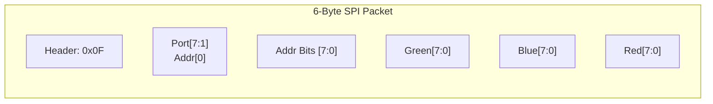
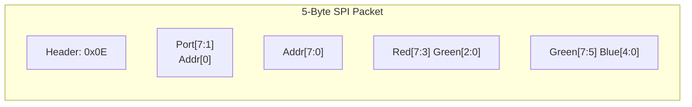

# WS2812 FPGA Driver

This project provides VHDL code for Lattice MachXO2/3 devices to efficiently drive multiple strings of WS2812 LEDs. It offloads the timing-critical WS2812 protocol from a host microcontroller or single-board computer (SBC) to the FPGA.

## Overview

The driver implements an SPI slave interface that receives pixel data and stores it in internal dual-port distributed RAM (frame buffers). A dedicated WS2812 controller then reads from these buffers and generates the precise pulse-width modulated signals required by the LEDs.

### Key Features
- **SPI Interface:** High-speed data transfer from host.
- **Multiple Channels:** Supports driving multiple LED strings in parallel (currently configured for 21 channels).
- **Buffered Output:** Decouples host communication from LED refresh timing.
- **Hardware Accelerated:** Precise WS2812 timing guaranteed by FPGA logic.

## System Architecture

The system typically consists of a **Raspberry Pi Zero 2W** (replacing the original Micropython-based modules) acting as the host, communicating via SPI with the Lattice FPGA.

### Block Diagram

## Communication Protocol

The FPGA acts as an SPI Slave. Data is sent in 6-byte packets to update individual pixels.

### SPI Packet Format

1. **Byte 0: Header**
   - Fixed value: `0x0F`
2. **Byte 1: Control/Port**
   - Bits [7:1]: Frame Buffer / Port selection (0-20).
   - Bit [0]: Most Significant Bit (MSB) of the Pixel Address (Bit 8).
3. **Byte 2: Address**
   - Bits [7:0]: Lower 8 bits of the Pixel Address.
4. **Byte 3: Green** (8-bit intensity)
5. **Byte 4: Blue** (8-bit intensity)
6. **Byte 5: Red** (8-bit intensity)

*Note: The color order in the SPI packet is G-B-R to match the internal WS2812 transmission order.*

## Interaction with py_marquee

This driver is designed to work with the [py_marquee](https://github.com/suttonr/py_marquee) Python library. The library handles the high-level matrix logic, font rendering, and animations, sending raw pixel updates to the FPGA over the SPI bus.
